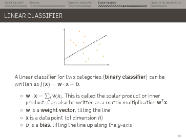
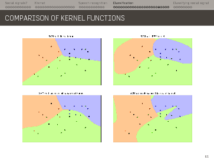

Machine Learning for Human-Robot Interaction
============================================

Lecture slides on Machine Learning for HRI.

- **Target audience**: MSc students
- **License**: CC-BY-SA (ie, you can freely reuse this material, as long as you
  clearly mention Séverin Lemaignan as the original author. If you
  modify/augment these slides, you *must* share the modifications under the same
  license)
- [Link to the PDF slides](ml-for-hri.pdf)

*I recommend [pdfpc](https://github.com/pdfpc/pdfpc) to present these slides: a
great PDF presentation tool, with support for embedded videos.*
